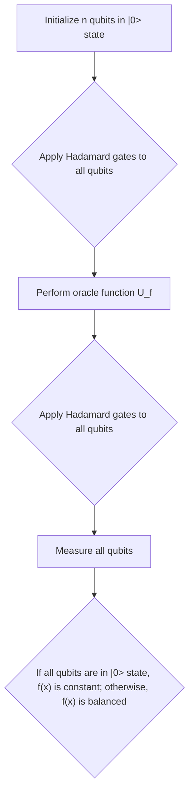

# The Deutsch-Jozsa Algorithm
The Deutsch-Jozsa algorithm is a quantum algorithm that solves the problem of determining whether a given function is constant or balanced. This problem can be formulated as follows:

Given a function f(x) that maps a binary string x of length n to a single bit, determine whether f(x) is a constant function (i.e., f(x) takes on the same value for all possible inputs) or a balanced function (i.e., f(x) takes on each possible value equally often, with half of the inputs mapping to 0 and half mapping to 1).

The classical solution to this problem requires evaluating the function for half of the possible inputs, and then checking whether all of the outputs are the same or not. In the worst case, this requires evaluating the function for 2^(n-1) + 1 inputs, which grows exponentially with n.

The Deutsch-Jozsa algorithm solves this problem with just one evaluation of the function f(x), using a quantum circuit consisting of n+1 qubits. The algorithm works as follows:

1. Initialize the first n qubits in the |0⟩ state and the last qubit in the |1⟩ state.
2. Apply Hadamard gates to all n+1 qubits.
3. Apply the function f(x) to the first n qubits, controlled by the last qubit.
4. Apply Hadamard gates to the first n qubits.
5. Measure the first n qubits.
6. The output of the algorithm will be 0 if the function f(x) is constant, and 1 if the function f(x) is balanced.

The key insight behind the Deutsch-Jozsa algorithm is that the Hadamard gates create a superposition of all possible inputs to the function f(x), which allows the algorithm to evaluate the function in parallel for all possible inputs. The controlled application of the function f(x) ensures that the quantum state contains information about the balance of the function, which can be extracted by applying Hadamard gates and measuring the first n qubits.

The Deutsch-Jozsa algorithm is an important early example of a quantum algorithm that provides a speedup over classical algorithms, and helped to establish the field of quantum computing as an area of active research.
